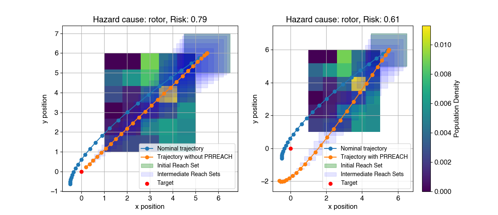

Code repository for "PRREACH: Probabilistic Risk Assessment Using Reachability for UAV Control", to be presented at ITSC 2025.

PRREACH is a new approach for designing risk-bounded controllers for Uncrewed Aerial Vehicles (UAVs). Given a hazard cause (e.g., a malfunctioning rotor, sensor error, strong winds), the dynamics of the UAV under influence of that hazard cause, and an initial set of states of the UAV, PRREACH will compute a controller that bounds the risk of the event of a hazard outcome (e.g., collision with a person or building). PRREACH achieves this controller optimization using reachability analysis. Below is an example result of this software prototype.

In this figure, on the left we see example UAV trajectories over a heatmap representing population density of city blocks in Philadelphia. The blue line shows the nominal trajectory over this area towards the target given by a red dot. The orange line shows the trajectory when the UAV experiences a deficient rotor, causing it to fly over a more densely populated area. The light blue rectangles show the reach sets of the UAV with the deficient rotor. 
    On the right we see the same heatmap and nominal UAV trajectory. The orange line here shows the UAV trajectory using a PRREACH controller, which directs the UAV away from the more densely populated regions. PRREACH used the reach sets to evaluate risk over all feasible trajectories of the UAV, and minimally change the UAV controller to maintain a bounded level of risk. This results in the reduced risk evaluation from 0.79 to 0.61 between the left and right plots, at the cost of the UAV on the right being  further from the target at the end of the time horizon.

